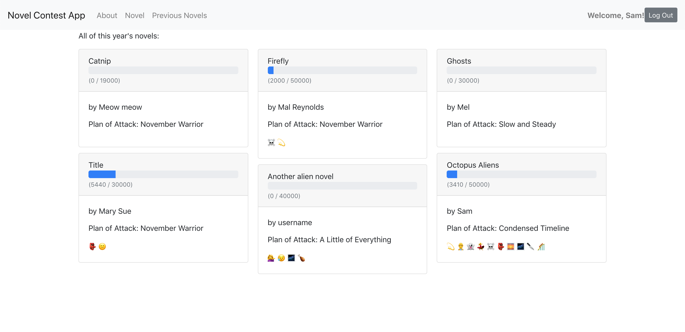

# Novel Tracker App (front end)

Ever wanted to run your own novel writing contest, or just keep track of your novel writing progress?

Novel Tracker is a single page React app (with a [Rails API](https://github.com/sharkham/novel-tracker-api) as a back-end) where users can create a novel project for each year of a novel writing contest, edit it, update their wordcount (which displays in a progress bar) and earn badges for achievements. Users can also view basic information about other contest participants like novel title, summary, progress and badges.

## Installation

1. Fork the repository
2. Clone the files to your computer
3. Navigate to `/novel-tracker-frontend` in your terminal
4. Run `npm install`
5. Run `npm start`. This will open the app in your browser of choice! Make sure to have the Rails api downloaded and running at the same time so the front end is able to interface with it.

## Usage Example

## Contributing
Pull requests are welcome. For major changes, please open an issue first to discuss what you would like to change.

## License
[MIT](https://choosealicense.com/licenses/mit/)
